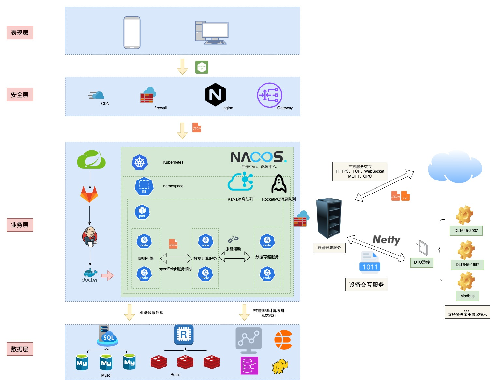
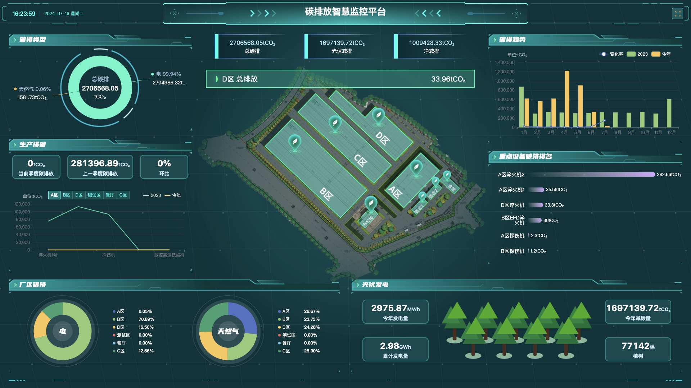
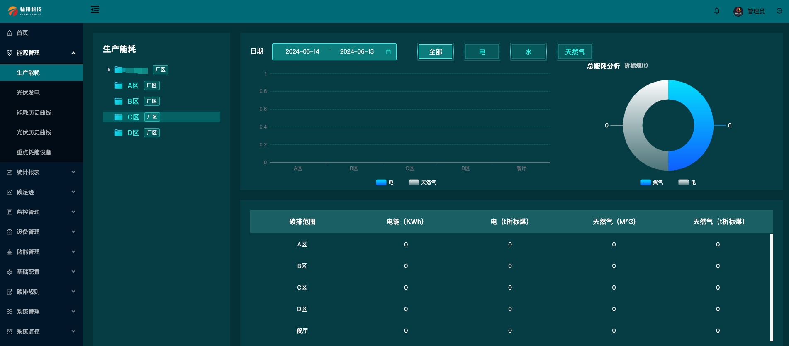
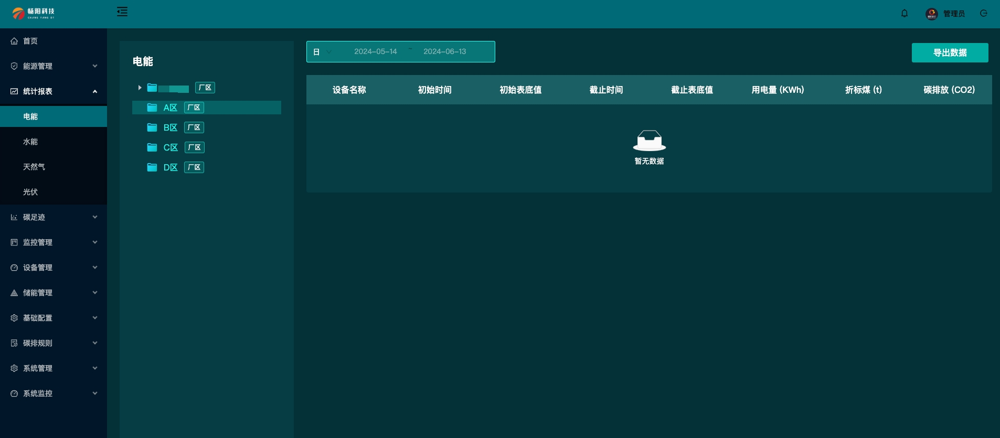
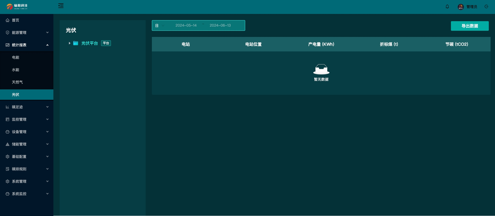
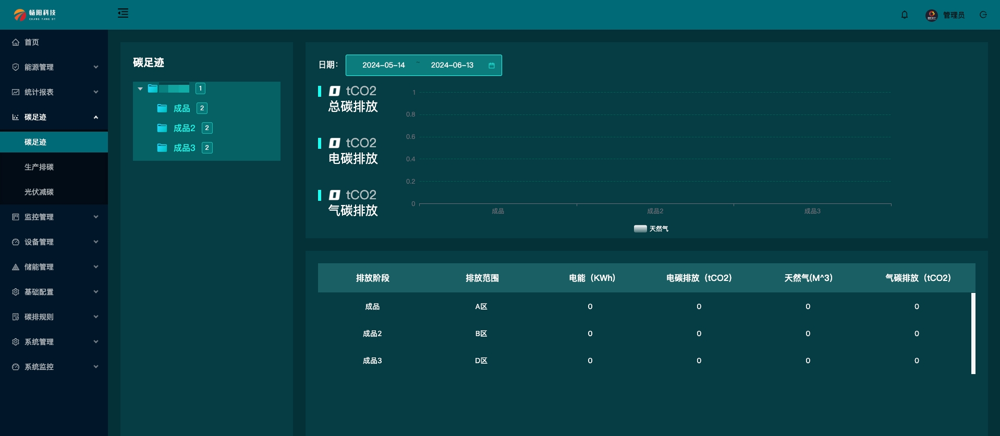
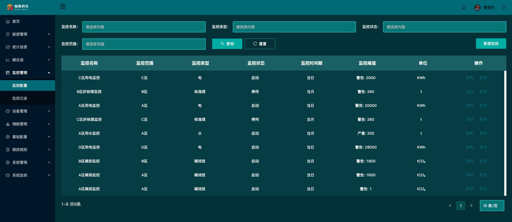
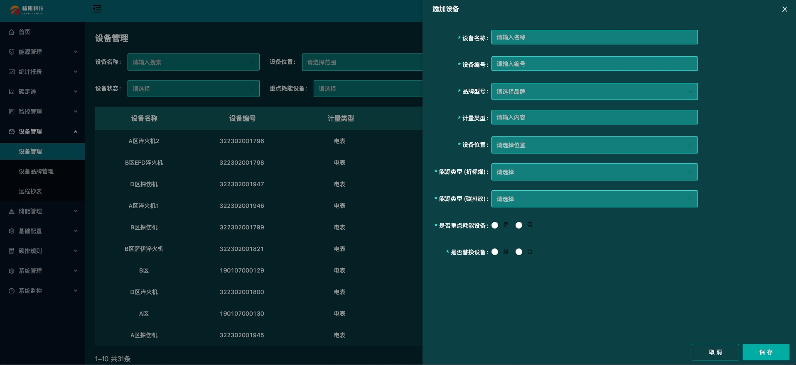
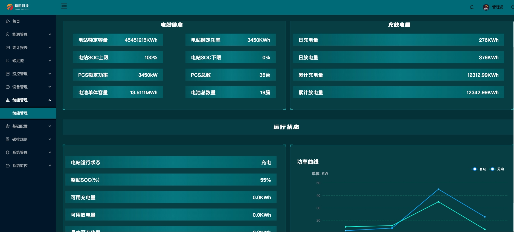
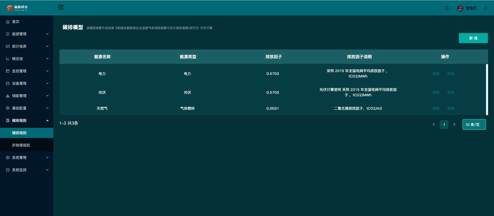

<h1 align="center">
  <a href="https://github.com/ChangyangOpenSource/carbon-energy-management" target="_blank">能碳管理系统</a>
  
[](https://www.apache.org/licenses/LICENSE-2.0)


</h1>

## 目录

- [项目介绍](#项目介绍)
  - [体验地址](#体验地址)
- [软件架构](#软件架构)
  - [技术架构](#技术架构)
- [快速入门](#快速入门)
- [功能展示](#功能展示)
- [更新日志](#更新日志)
- [许可证](#许可证)
- [联系我们](#联系我们)

## 项目介绍

能碳管理系统，集成了实时监测、数据分析、溯源追踪、碳排风险管理以及碳足迹分析等核心功能。该系统利用传感器采集生产数据，远程数据传输技术传输到数据中台，对工厂内的电、水等能源消耗数据的实时获取、监控以及定位，实现数据追踪、数据分析；利用数据分析模型分析计算工厂的能源消耗和碳排放，设置监控预警避免碳排放超标情况，确保企业碳排的合规合理。同时，系统对全厂的资源消耗进行全面分析数据，提供可视化的报告和图表，展示企业的能源消耗和碳排放情况，帮助企业了解自身的碳足迹，能更准确地设定减排目标，提高能源利用效率和降低碳排放量，助力实现企业的可持续发展目标。

### 体验地址
[测试地址](https://www.changyangdt.com/carbonDemo/)

账号：local
密码：Changyang666!@#

## 软件架构

本系统采用前后端分离模式开发和运行。前端使用vue框架并基于 Ant Design Of Vue 组件库进行开发。后端使用 springboot + redis + mysql 微服务方式进行搭建，可单机运行也可集群运行。 

### 技术架构
-
    
    
#### 环境配置要求：

- 语言：Java 8+ (小于17)

- IDE(JAVA)： IDEA (必须安装lombok插件 )

- IDE(前端)： Vscode、WebStorm、IDEA

- 依赖管理：Maven

- 缓存：Redis

- 数据库脚本：MySQL5.7+  &  Oracle 11g & Sqlserver2017（其他数据库，[需要自己转](https://my.oschina.net/jeecg/blog/4905722)）

#### 后端

- 基础框架：Spring Boot 2.6.14

- 微服务框架： Spring Cloud Alibaba 2021.0.1.0

- 持久层框架：MybatisPlus 3.5.1

- 报表工具： JimuReport 1.5.8

- 安全框架：Apache Shiro 1.10.0，Jwt 3.11.0

- 微服务技术栈：Spring Cloud Alibaba、Nacos、Gateway、Sentinel、Skywalking

- 数据库连接池：阿里巴巴Druid 1.1.22

- 日志打印：logback

- 其他：autopoi, fastjson，poi，Swagger-ui，quartz, lombok（简化代码）等。


#### 前端

- Vue2版本：`Vue2.6+@vue/cli+AntDesignVue+Viser-vue+Vuex等`
- node版本: 16.18.1

## 快速入门
以下指南将帮助你在本地机器上安装和运行该项目，进行开发和测试

### 安装步骤：
1.克隆仓库
```bash
git clone https://github.com/ChangyangOpenSource/carbon-energy-management.git
```
2.安装依赖
```bash
npm install
```
3.运行项目

```bash
npm run dev
```
## 功能展示
### 能碳管理平台
- 数据大屏
   
- 生产能耗
   
- 统计报表-电能
    
- 统计报表-光伏
   
- 碳足迹
    
- 监控配置
   
- 设备管理
    
- 储能管理
   
- 碳排规则
   

## 更新日志

### 20240610 更新能碳管理平台设备管理和碳足迹模块
- 增加 新入网设备
- 修复 是否替换设备按钮不能点击
- 增加 碳足迹气碳设算字段
- 增加 光伏减碳周期统计柱状图

## 许可证

[License](./LICENSE)

## 联系我们 
* 如果您想使用功能更完善的能碳管理平台系统，请联系以下企业微信！
* 如果您想基于能碳系统进行定制开发，我们提供有偿定制服务支持！
* 其他合作模式不限，欢迎来撩！


